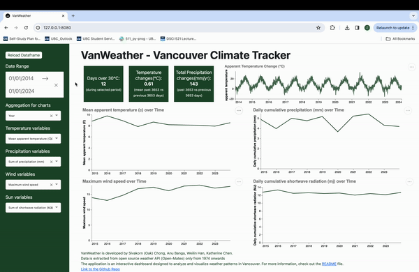

# VanWeather - Vancouver Climate Extremes Dashboard ⛅🌧️🌞 🌨️❄️

Welcome to the VanWeather, an interactive tool designed to analyze and visualize weather patterns in Vancouver.
## Purpose 

#### The Problem
Climate conditions in the Vancouver region have undergone significant changes over the years, resulting in shifting climate patterns, increased climate extremes, and notable environmental impacts. However, stakeholders currently lack accessible tools to effectively analyze historical climate data and compare trends over time. This limitation hinders efforts to understand the evolving climate landscape and take necessary actions to address and adapt to the effects of climate change.

#### Solution
VanWeather dashboard addresses the challenge of understanding and adapting to climate change impacts in Vancouver by providing an interactive platform that integrates historical and recent meteorological data. This dashboard allows users to analyze and visualize climate trends and patterns, facilitating informed discussions, policy formulation, and community actions to address and adapt to the evolving climate dynamics at the local level. By empowering stakeholders with accessible insights into Vancouver's changing climate, the VanWeather dashboard supports proactive measures and sustainable decision-making to enhance preparedness for climate-related challenges in the city.

## The Dashboard


## Get Involved
Click [here](https://dsci-532-2024-10-vanweather.onrender.com/) to start using VanWeather dashboard.

To get started with the dashboard, choose your desired date range and utilize the aggregation options (daily, weekly, monthly, yearly) on the filter. This will allow you to view weather trends for temperature, wind, precipitation, and sunlight in Vancouver. Explore and analyze the weather trends and patterns over the years in the city of Vancouver.
If you have any feedback or input for our team, you can reach out via opening a [new issue](https://github.com/UBC-MDS/DSCI-532_2024_10_vanweather/issues/new) in this repository.

## Developer Note:
To use this dashboard on your local machine, please follow the instructions provided below.
1. Clone the repository locally. Open your terminal and execute the following command:

    ```console
     git clone https://github.com/UBC-MDS/DSCI-532_2024_10_vanweather.git
    ```

2. Create and activate the `conda` environment. Navigate to the root directory of the repository and execute the following command:
    ```console
     conda env create --file environment.yml
    ```

    ```console
     conda activate vanweather
    ```

3. Create a branch for local development and make your changes:

    ```console
     git checkout -b name-of-your-branch
    ```

4. To run the dashboard. Navigate to `src` then run `app.py`: 

    ```console
     cd src
    ```

    ```console
     python app.py
    ```
5. You should expect to see output in your terminal that looks similar to:
    ```console
        Running on http://127.0.0.1:8080 
    ```
    Paste this link into your preferred browser to load the app.

## Contributing Guidelines
Please refer to our contributing [guidelines](https://github.com/UBC-MDS/DSCI-532_2024_10_vanweather/blob/main/CONTRIBUTING.md) to learn more about contributing to the VanWeather dashboard project. This project follows a [Code of Conduct](https://github.com/UBC-MDS/DSCI-532_2024_10_vanweather/blob/main/CODE_OF_CONDUCT.md), and by participating, you agree to uphold its terms. Thank you for your interest in contributing!

## License
This project is licensed under the terms of the [MIT license](https://github.com/UBC-MDS/DSCI-532_2024_10_vanweather/blob/main/LICENSE).

## Contributors
[@AnuBanga](https://github.com/AnuBanga), [@czwcandy](https://github.com/czwcandy) [@sivakornchong](https://github.com/sivakornchong) [@WeilinHan8](https://github.com/WeilinHan8)